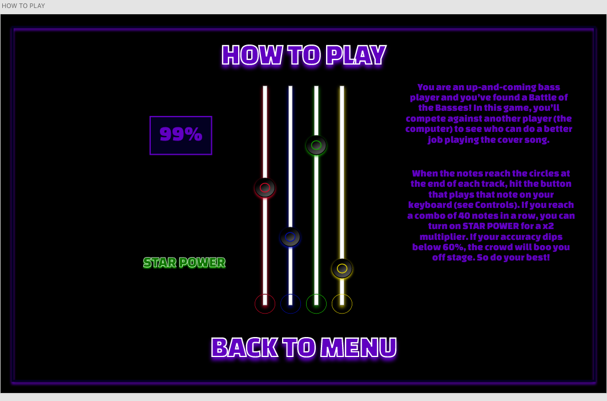
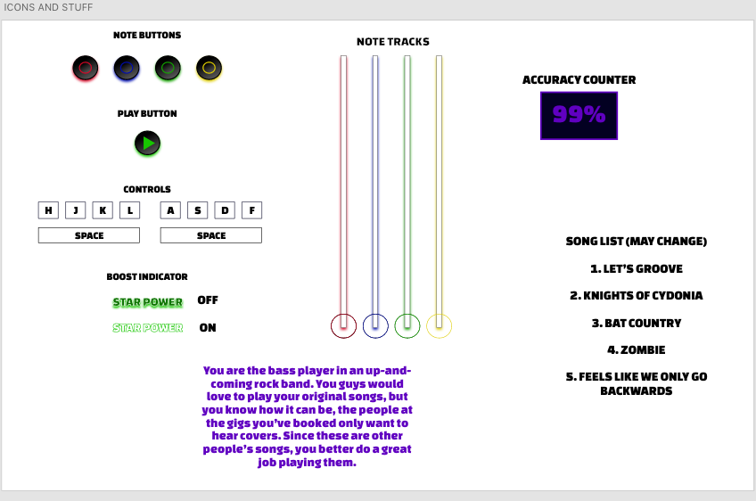
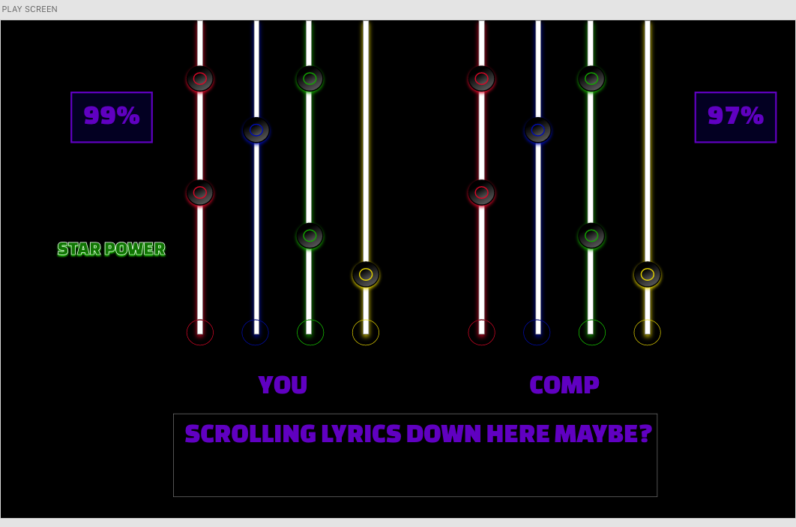
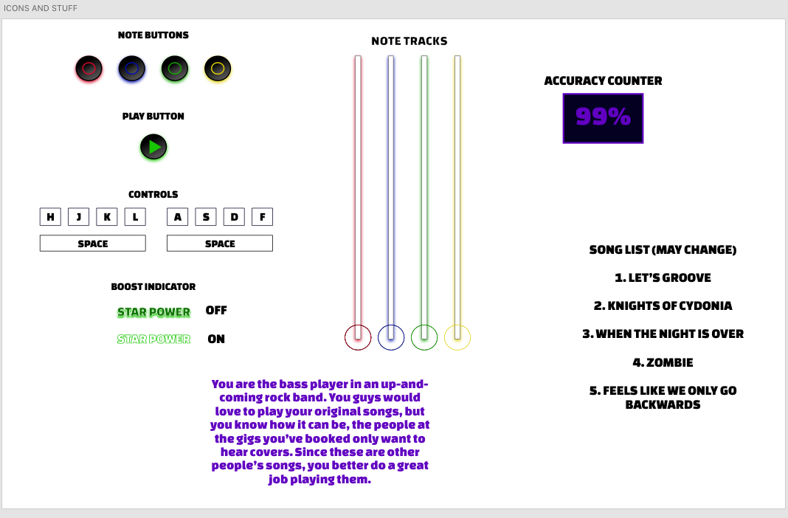

# game-proposal
My proposal for the Mod 1 project!

# Bass Champion!

## Rules of the Game
This is basically a Guitar Hero clone. When the note circles reach the hit zone, the player must tap the corresponding key on their keyboard. The "two-player" aspect is that they must have a higher score or possibly a higher accuracy rate than the Computer (which will have its accuracy randomized within a certain range). I would like there to be two different possible lose states, one for if they get a lower score than the Computer and one for if their accuracy dips below 60%, at which point they will be booed off the stage (like in the real game, you see lol). The player also has the option to tap their space bar to activate Star Power, which gives them a multiplier on their score.
## Technical Challenges
- Getting the timing right with the note circles reaching their hit zones and that being a condition for the player getting points may be kind of difficult, but I have a few ideas for how this could be accomplished
- Timing the animations for the notes going down the track to the beat of the song is something I will probably have to experiment with for a while
- I can see turning Star Power (which is a stretch goal for me at this point in time) on and off and altering the points based around it being a challenge for sure.

## Wireframes 
The screen you see when the page is first opened. The BASS CHAMPION will glow (ideally).

The screen you're taken to when you click "HOW TO PLAY" on the start screen

The screen you're taken to when you click "CONTROLS" on the start screen

Once you click "CLICK TO START" on the start screen, you get to pick which song you want to play here. (Clicking on any part of the song box will play a preview of it, while clicking on the play button will take you to the play screen.)

This is what the actual play screen will look like (the computer's note track is shown on the right, the player's note track is on the left side.) I would also like to have the lyrics to the chosen song scrolling at the bottom (stretch goal).

This just shows all the icons/elements I "drew" and what they are specifically. Also an alternate story for the game.

## Timeline
<ul>
<li>Tuesday: Start pseudocoding, figuring out what exact methods/functions/etc. I'm going to need for this to work. Hopefully start on JS
 
<li> Wednesday: Focus entirely on JS (work on controls and scoring system as well as note classes), and start acquiring assets (turning my wireframe icons into game assets, saving mp3s of the songs, album covers, etc.), also linking the pages together.
 
<li> Thursday: Create the keyframes for the note tracks and figure out how to time them perfectly with the songs (maybe use delays or setTimeout?). Also work on conditionals for the points and accuracy counters. Also create functions and such for the Computer.
 
<li> Friday: Ideally finish all major JS (including song/note timing), start working on CSS
 
<li> Saturday: Flesh out minor JS (stretch goals like star power and scrolling lyrics), and continue working on CSS (can be saved for later if JS is not cooperating)
 
<li> Sunday: Make any final changes and finish up CSS. Test, test, test!